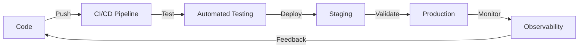

<div align="center">

# 👨‍💻 Jhon Meza

### DevOps Engineer | Cloud Architect | Infrastructure as Code Specialist

[](https://www.linkedin.com/in/jhonmezaa/)
[](mailto:jmezariveira@gmail.com)
[](https://github.com/jhonmezaa)

</div>

---

<div align="center">
  
</div>

---

## 🚀 About Me

```yaml
name: Jhon Meza
role: DevOps Engineer & Cloud Architect
location: Remote
mindset: "Automate everything, fail fast, learn faster"
motto: "I like to put out fires 🔥"

currently_working_with:
  - AWS Cloud Infrastructure
  - Infrastructure as Code (Terraform & CloudFormation)
  - CI/CD Pipelines
  - Container Orchestration

learning:
  - Kubernetes
  - Advanced DevOps Practices
  - Cloud Native Technologies
  - GitOps Workflows

interests:
  - Cloud Architecture
  - System Automation
  - Monitoring & Observability
  - DevSecOps
```

---

## 🛠️ Tech Stack & Tools

### ☁️ Cloud Platforms
<p align="left">
  
  
  
</p>

### 🏗️ Infrastructure as Code
<p align="left">
  
  
  
  
</p>

### 🐳 Containers & Orchestration
<p align="left">
  
  
  
  
</p>

### 🔄 CI/CD & Automation
<p align="left">
  
  
  
  
  
</p>

### 📊 Monitoring & Observability
<p align="left">
  
  
  
  
  
</p>

### 💻 Programming & Scripting
<p align="left">
  
  
  
  
  
</p>

### 🗄️ Databases & Storage
<p align="left">
  
  
  
  
  
</p>

### 🔐 Security & Compliance
<p align="left">
  
  
  
  
</p>

### 🛠️ Version Control & Collaboration
<p align="left">
  
  
  
  
</p>

### 🎨 Development Tools
<p align="left">
  
  
  
  
</p>

---

## 💼 What I Do

<table>
<tr>
<td width="50%">

### 🎯 Infrastructure Automation
- Design and implement scalable cloud infrastructure
- Automate deployment processes with IaC
- Optimize cloud costs and resource utilization
- Build resilient and highly available systems

</td>
<td width="50%">

### 🔄 CI/CD Excellence
- Design and maintain CI/CD pipelines
- Implement GitOps workflows
- Automate testing and deployment
- Reduce deployment time and errors

</td>
</tr>
<tr>
<td width="50%">

### 📊 Monitoring & Reliability
- Implement comprehensive monitoring solutions
- Set up alerting and incident response
- Perform capacity planning and scaling
- Ensure SLA compliance and uptime

</td>
<td width="50%">

### 🔒 Security & Compliance
- Implement security best practices
- Automate security scanning and compliance
- Manage secrets and credentials securely
- Conduct infrastructure security audits

</td>
</tr>
</table>

---

## 📈 GitHub Stats

<div align="center">
  
  
</div>

<div align="center">
  
</div>

<div align="center">
  
</div>

---

## 🏆 Achievements & Certifications

<div align="center">

```yaml
Certifications:
  - AWS Certified Solutions Architect
  - Terraform Associate
  - Kubernetes Administrator (CKA)
  - DevOps Professional

Achievements:
  - Reduced infrastructure costs by 40% through optimization
  - Implemented zero-downtime deployments
  - Automated 90% of manual deployment processes
  - Built highly scalable microservices infrastructure
```

</div>

---

## 🎓 Continuous Learning

<div align="center">

| Technology | Progress | Status |
|------------|----------|--------|
| Kubernetes | ████████░░ 80% | 🚀 In Progress |
| Service Mesh (Istio) | ██████░░░░ 60% | 📚 Learning |
| GitOps (ArgoCD/Flux) | ███████░░░ 70% | 🔄 Practicing |
| Cloud Native Security | █████░░░░░ 50% | 🔐 Exploring |

</div>

---

## 💡 Philosophy

<div align="center">

> *"The best infrastructure is invisible infrastructure"*

### 🎯 Core Principles

**Automation First** | **Infrastructure as Code** | **Security by Default** | **Continuous Improvement**



</div>

---

## 📫 Let's Connect!

<div align="center">

### I'm always open to interesting conversations and collaboration opportunities!

<p align="center">
  <a href="https://www.linkedin.com/in/jhonmezaa/" target="_blank">
    
  </a>
  <a href="mailto:jmezariveira@gmail.com">
    
  </a>
</p>

### 💬 Ask me about
`AWS` · `Terraform` · `Kubernetes` · `CI/CD` · `CloudFormation` · `DevOps` · `Cloud Architecture` · `Infrastructure Automation`

</div>

---

<div align="center">

### ⚡ Fun Fact
*I automate things for a living, but I still manually make my coffee ☕*

---

**"Building the future, one deployment at a time"** 🚀


</div>
